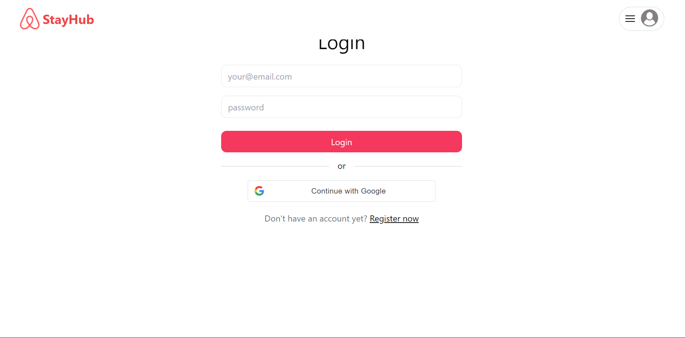
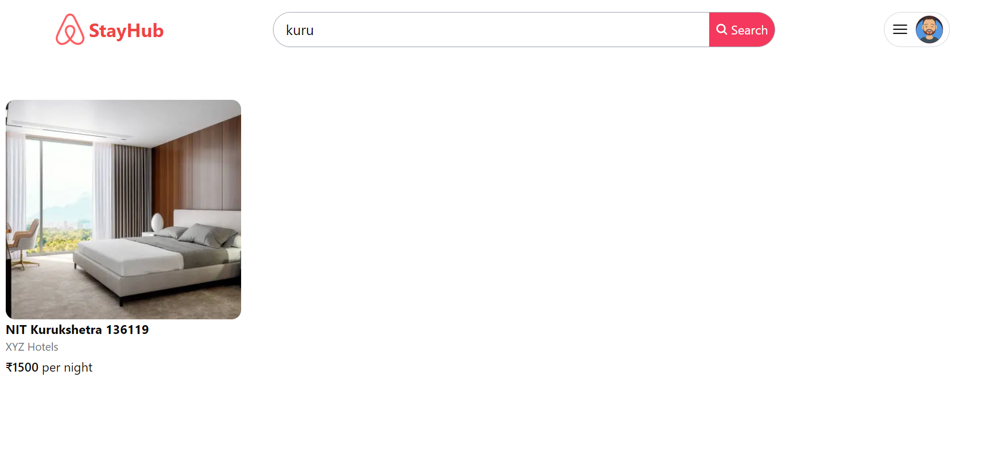
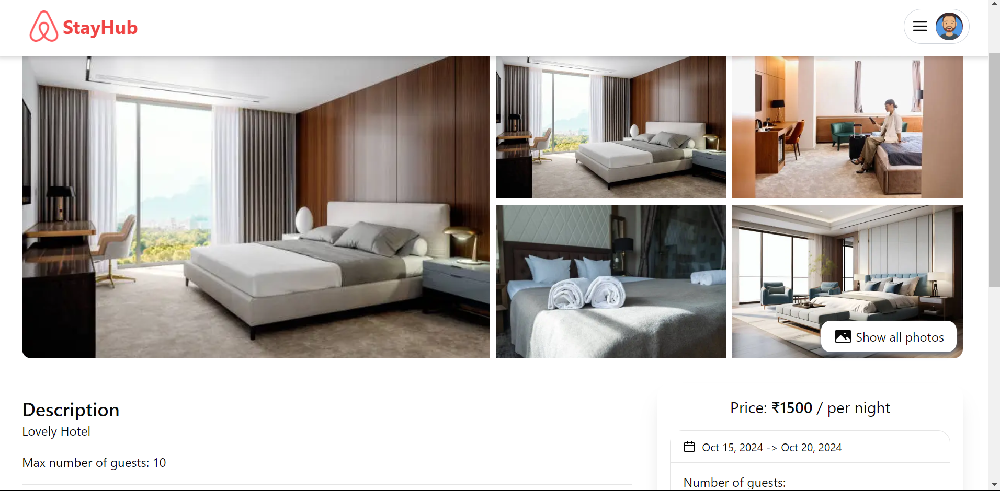
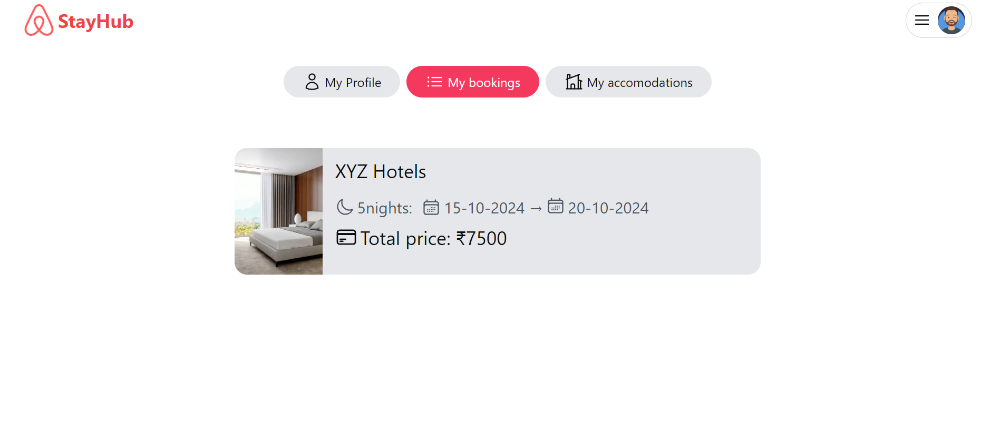
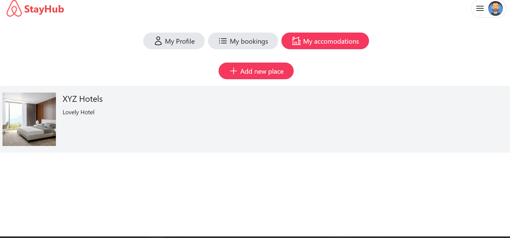

## Overview

This project is a full-stack web application developed as a clone of Airbnb using the MERN stack (MongoDB, Express.js, React.js, Node.js). It aims to replicate the core functionality , allowing users to search for accommodations, view details, make bookings, and manage their listings.

## Getting Started

1. **Clone the Repository:**

   ```bash
   my github link

   ```

2. **Install dependencies:**

   Navigate to client directory and install frontend dependencies using yarn

   ```
   yarn install
   ```

   Similary navigate to api folder and install backend dependencies

   ```
   yarn install
   ```

3. **ENV variables:**

   - create .env file in the client folder and add these variables

     #### VITE_BASE_URL= http://localhost:4000

     #### VITE_GOOGLE_CLIENT_ID= your google client id

   - create .env file in the api folder and add these variables

     #### PORT= 4000

     #### DB_URL= your db url

     #### JWT_SECRET= your secret (string)

     #### JWT_EXPIRY= 20d

     #### COOKIE_TIME= 7

     #### SESSION_SECRET= your secret session (string)

     #### CLOUDINARY_NAME= your secret session

     #### CLOUDINARY_API_KEY= your cloudinary key

     #### CLOUDINARY_API_SECRET= your cloudinary api secret

     #### CLIENT_URL= http://localhost:5173

4. **Run project:**
   - Open terminal, navigate to client directory and run below command to start frontend
   ```
       yarn run dev
   ```
   - Open another terminal, navigate to api directory and run this command to start backend server
   ```
       yarn start
   ```

## Features

- **User Authentication:** Users can sign up, log in, and log out securely. Passwords are hashed for security.
- **Google Login:** Users can sign up and log in using their gmail.

  

- **Search Listings:** Users can search for accommodations.

  

- **View Listings:** Users can view detailed information about each accommodation, including photos, descriptions, amenities.

  

- **Make Bookings:** Authenticated users can book accommodations for specific dates.

  

- **Manage Listings:** Hosts can create, edit, and delete their listings.

  

- **Responsive Design:** The application is designed to be responsive and work seamlessly across different devices.

  

## Technologies Used

- **MongoDB:** NoSQL database for storing user data, listings.
- **Express.js:** Web application framework for building the backend server.
- **React.js:** JavaScript library for building the user interface.
- **Node.js:** JavaScript runtime environment for executing server-side code.
- **Tailwind CSS:** A utility-first CSS framework
-
- **JWT:** JSON Web Tokens for secure user authentication.
-
- **Google Cloud:** For gmail based authentication
